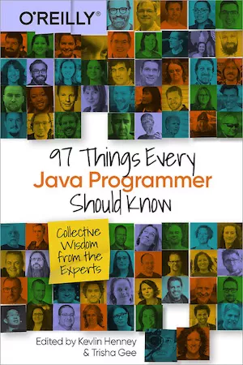

<h2>97 Things Every Java Programmer Should Know</h2>

<a href="http://shop.oreilly.com/product/0636920048824.do">97 Things Every Java Programmer Should Know</a>
edited by Kevlin Henney, Trisha Gee, with contributions by Peter Hilton, published by O’Reilly Media in May 2020.

Peter’s three contributions also appear in full on his blog:

<ul>
<li><a href="blog/get-better-at-naming">Get better at naming things</a></li>
<li><a href="blog/refactor-boolean-enumeration">Refactor Boolean values to enumerations</a></li>
<li><a href="blog/documentation-comments">Write one-sentence documentation comments</a></li>
</ul>

<h2>Play for Scala</h2>

<a href="http://bit.ly/playscala2p">Play for Scala</a> by Peter Hilton, Erik Bakker and Francisco Canedo was published by Manning Publications in September 2013.

The book teaches web developers how to use the <a href="http://www.playframework.com">Play Framework</a> to build web applications using the <a href="http://www.scala-lang.org">Scala</a> programming language.

Peter Hilton presented widely on the topic and was a certified trainer for Typesafe’s
<a href="http://typesafe.com/how/training/fasttracktoplaywithscala">Fast Track to Play with Scala</a> training course,
before they rebranded as <a href="https://www.lightbend.com/">Lightbend</a>.

