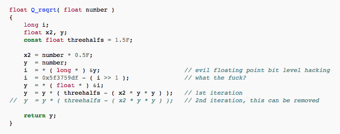
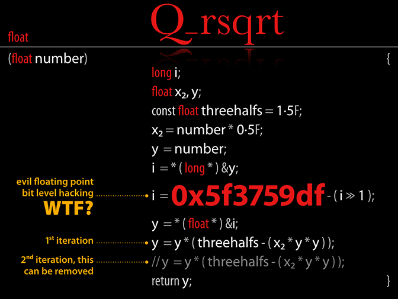

The way we visually present code today would do little to surprise the first owner of the 1955 IBM typewriter that introduced the Courier typeface.
Innovations since then include little more than bigger monitors, syntax colouring and better monospace typefaces.
Meanwhile, layout and typography, already centuries old during the desktop publishing revolution thirty years ago, inform the visual presentation of most kinds of text.

The goal of this talk is to reconsider what code looks like.
This talk uses step-by-step examples to show how layout and typography can make code beautiful, and considers how this would change the programming experience.
After all, as Knuth pointed out, ‘Programs are meant to be read by humans, and only incidentally for computers to execute.’

Finally, we’ll look forwards and focus on one typographic innovation that we will actually be able to use in the near future: functional programming font ligatures.

# Example

For example, the [Fast inverse square root](https://en.wikipedia.org/wiki/Fast_inverse_square_root) code would look like this in the average IDE.

However, the following changes, presented one at a time, improve the visual design.

1. Modern typeface
2. Colour scheme more appropriate for game code
3. Header style for function name
4. Two-column layout
5. Pull-out code comments
6. Magic number highlight and abbreviate to ‘WTF’
7. Special characters, superscripts and subscripts
8. Tighten up magic number kerning

The result is much more cool, despite having the same content, and might even be easier to read:

That’s just the start, and is isolated to a small snippet of code.
Other examples will take different directions, such as presenting multiple compilation units in a larger page layout.

## Conference presentations

* [ACCU 2017](https://conference.accu.org/site/stories/2017/schedule.html) - 26 April 2017
