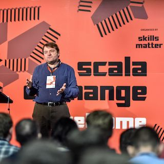
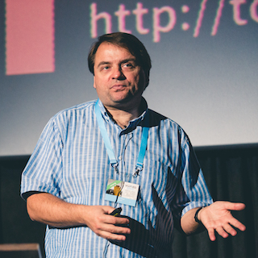

Peter Hilton has presented at conferences, user groups and companies in several countries on a variety of software development topics.
See also: <a href="http://lanyrd.com/profile/peterhilton/">Peter Hilton on Lanyrd</a>.

Please <a href="../contact">contact Peter</a> if you would like him to speak at your event or company.

## Upcoming & recent

<table class="table">
<tr>
	<th>Date</th>
	<th>Title</th>
	<th>Venue</th>
	<th>Location</th>
	<th>Media</th>
</tr>
<tr>
	<td>2017-10-05</td>
	<td><a href="workflow-service-architecture">Process-oriented reactive service architecture</a></td>
	<td><a href="https://www.asas.nl/2017/program/">ASAS 2017</a></td>
	<td class="flag nl">Arnhem</td>
	<td></td>
</tr>
<tr>
	<td>2017-09-28</td>
	<td><a href="documentation-workshop">Minimum viable documentation</a> (workshop)</td>
	<td><a href="http://agilecambridge.net/2017/sessions/index.php?session=18">Agile Cambridge 2017</a></td>
	<td class="flag uk">Cambridge</td>
	<td></td>
</tr>
<tr>
	<td>2017-08-02</td>
	<td><a href="beautiful-code">Beautiful code: code with better type</a></td>
	<td><a href="http://edinburgh.bcs.org/events/2017/170802.htm">BCS Edinburgh</a></td>
	<td class="flag uk">Edinburgh</td>
	<td></td>
</tr>
<tr>
	<td>2017-05-16</td>
	<td><a href="maintainable-code">How to write maintainable code</a></td>
	<td><a href="http://amsterdam2017.codemotionworld.com/">Codemotion Amsterdam 2017</a></td>
	<td class="flag nl">Amsterdam</td>
	<td><a href="https://www.youtube.com/watch?v=6jmUmZX2pok">video</a></td>
</tr>
<tr>
	<td>2017-05-12</td>
	<td><a href="documentation-workshop">Documentation for software developers</a> (workshop)</td>
	<td><a href="http://itakeunconf.com/sessions/documentation-for-software-developers/">I T.A.K.E. (Un) conference 2017</a></td>
	<td class="flag ro">Bucharest</td>
	<td></td>
</tr>
<tr>
	<td>2017-04-27</td>
	<td><a href="documentation-workshop">Documentation for software developers</a> (workshop)</td>
	<td><a href="https://conference.accu.org/site/stories/2017/schedule.html">ACCU 2017</a></td>
	<td class="flag uk">Bristol</td>
	<td></td>
</tr>
<tr>
	<td>2017-04-26</td>
	<td><a href="beautiful-code">Code with better type</a> (lightning talk)</td>
	<td><a href="https://conference.accu.org/site/stories/2017/schedule.html">ACCU 2017</a></td>
	<td class="flag uk">Bristol</td>
	<td></td>
</tr>
<tr>
<td>2017-03-16</td>
	<td>README Driven Development (mini-workshop)</td>
	<td><a href="https://www.meetup.com/010DEV/events/237779181/">010DEV</a></td>
	<td class="flag nl">Rotterdam</td>
	<td></td>
</tr>
<tr>
<td>2017-03-16</td>
	<td>E-Prime for scientific writing</td>
	<td>Erasmus MC</td>
	<td class="flag nl">Rotterdam</td>
	<td></td>
</tr>
<tr>
	<td>2017-03-01</td>
	<td>Code style, Code review & pair programming, Learning to be a better coder</td>
	<td><a href="http://www.signavio.com/">Signavio GmbH</a></td>
	<td class="flag de">Berlin</td>
	<td></td>
</tr>
<tr>
	<td>2017-02-10</td>
	<td><a href="maintainable-code">How to write maintainable Scala code</a></td>
	<td><a href="https://www.meetup.com/Data-Driven-Rijnmond/events/236256531/">Data Driven Rijnmond</a></td>
	<td class="flag nl">Capelle aan den IJssel</td>
	<td></td>
</tr>
<tr>
	<td>2016-12-15</td>
	<td><a href="maintainable-code">How to write maintainable Scala code</a></td>
	<td><a href="https://www.meetup.com/amsterdam-scala/events/235864793/">Amsterdam.scala</a></td>
	<td class="flag nl">Amsterdam</td>
	<td></td>
</tr>
<tr>
	<td>2016-12-09</td>
	<td><a href="maintainable-code">How to write maintainable Scala code</a></td>
	<td><a href="https://skillsmatter.com/conferences/7432-scala-exchange-2016">Scala eXchange</a></td>
	<td class="flag uk">London</td>
	<td>
		<a href="http://www.slideshare.net/pirhilton/how-to-write-maintainable-scala-code">slides</a>
		<a href="https://skillsmatter.com/skillscasts/9104-how-to-write-maintainable-scala-code#video">video</a>
	</td>
</tr>
<tr>
	<td>2016-12-07</td>
	<td><a href="maintainable-code">How to write maintainable Scala code</a></td>
	<td><a href="https://www.meetup.com/brabant-scala/events/235797609/">Brabant.scala</a></td>
	<td class="flag nl">Eindhoven</td>
	<td></td>
</tr>
<tr>
	<td>2016-11-17</td>
	<td><a href="workflow-service-architecture">Process-oriented reactive service architecture</a></td>
	<td><a href="http://topconf.com/tallinn-2016/trackevent/process-oriented-reactive-service-architecture/">Topconf</a></td>
	<td class="flag ee">Tallinn</td>
	<td><a href="http://www.slideshare.net/pirhilton/processoriented-reactive-service-architecture">slides</a>
	<a href="https://www.youtube.com/watch?v=_LUBKprSy1Q">video</a></td>
</tr>
<tr>
	<td>2016-11-16</td>
	<td><a href="documentation">Documentation avoidance for developers</a></td>
	<td><a href="http://topconf.com/tallinn-2016/trackevent/documentation-avoidance-for-developers/">Topconf</a></td>
	<td class="flag ee">Tallinn</td>
	<td><a href="http://www.slideshare.net/pirhilton/documentation-avoidance">slides</a>
	<a href="https://www.youtube.com/watch?v=WcSKug65xJ8">video</a></td>
</tr>
<tr>
	<td>2016-11-03</td>
	<td><a href="documentation">Documentation avoidance for developers</a></td>
	<td><a href="http://www.nljug.org/jfall/timetable/2016/">J-Fall</a></td>
	<td class="flag nl">Ede</td>
	<td><a href="https://www.youtube.com/watch?v=rJfuTAEl4Ts">video</a></td>
</tr>
<tr>
	<td>2016-10-21</td>
	<td><a href="documentation">Documentation avoidance for developers</a></td>
	<td><a href="https://voxxeddays.com/thessaloniki/">Voxxed Days Thessaloniki</a></td>
	<td class="flag gr">Thessaloniki</td>
	<td></td>
</tr>
<tr>
	<td>2016-10-12</td>
	<td>Code Smells</td>
	<td><a href="http://www.signavio.com/">Signavio GmbH</a></td>
	<td class="flag de">Berlin</td>
	<td></td>
</tr>
<tr>
	<td>2016-09-21</td>
	<td>Putting the ‘shared’ into finance shared services with collaborative models</td>
	<td><a href="http://www.sharedservicesexchange.co.uk">Finance Shared Services & GBS Exchange</a></td>
	<td class="flag nl">Hoofddorp</td>
	<td></td>
</tr>
<tr>
	<td>2016-07-19</td>
	<td><a href="comments">How to write good comments</a></td>
	<td><a href="http://www.daysofcode.nl/">Days of Code</a></td>
	<td class="flag nl">Rotterdam</td>
	<td><a href="http://www.slideshare.net/pirhilton/how-to-write-good-comments">slides</a></td>
</tr>
<tr>
	<td>2016-07-18</td>
	<td><a href="http">HTTP demystified for web developers</a></td>
	<td><a href="http://www.daysofcode.nl/">Days of Code</a></td>
	<td class="flag nl">Rotterdam</td>
	<td><a href="http://www.slideshare.net/pirhilton/http-demystified-for-web-developers/">slides</a></td>
</tr>
<tr>
	<td>2016-06-17</td>
	<td><a href="documentation">Documentation avoidance for developers</a></td>
	<td><a href="http://joyofcoding.org/">Joy of Coding</a></td>
	<td class="flag nl">Rotterdam</td>
	<td></td>
</tr>
<tr>
	<td>2016-06-13</td>
	<td><a href="http://irmuk.co.uk/eac2016/day1.cfm#Day1PS4">Modelling with Business Process Patterns</a></td>
	<td><a href="http://www.irmuk.co.uk/bpm2016/">IRM UK</a></td>
	<td class="flag uk">London</td>
	<td></td>
</tr>
<tr>
	<td>2016-05-27</td>
	<td>Modelling with Business Process Patterns</td>
	<td>banking industry</td>
	<td class="flag uk">London</td>
	<td></td>
</tr>
</table>

## Selected previous presentations

<table class="table">
<tr>
	<th>Date</th>
	<th>Title</th>
	<th>Venue</th>
	<th>Event</th>
	<th>Location</th>
	<th>Media</th>
</tr>
<tr>
	<td>2016-04-25</td>
	<td>Leveraging process maps &amp; models for continuous improvement (workshop)</td>
	<td><a href="http://www.opexweekeurope.com/">OPEX &amp; Process Transformation Week</a></td>
	<td>conference</td>
	<td class="flag uk">London</td>
	<td></td>
</tr>
<tr>
	<td>2016-04-22</td>
	<td><a href="documentation">Documentation avoidance for developers</a></td>
	<td><a href="http://progscon.co.uk/talks#tlk-peterhiltontalk">ProgSCon London</a> (keynote)</td>
	<td>conference</td>
	<td class="flag uk">London</td>
	<td><a href="https://www.infoq.com/presentations/minimal-code-documentation">video</a></td>
</tr>
<tr>
	<td>2016-03-03</td>
	<td>Achieving process excellence through organisation-wide collaborative BPM</td>
	<td><a href="http://c-parity.com/CP/2nd-annual-global-process-improvement-operational-excellence-summit-2/">Process Improvement &amp; OPEX Summit</a></td>
	<td>conference</td>
	<td class="flag uk">London</td>
	<td></td>
</tr>
<tr>
	<td>2015-06-06</td>
	<td><a href="http://www.typesafe.com/subscription/training">Fast Track To Play With Scala</a> (training course)</td>
	<td><a href="http://event.scaladays.org/scaladays-amsterdam-2015#03-Training">Scala Days 2015</a></td>
	<td>training</td>
	<td class="flag nl">Amsterdam</td>
	<td></td>
</tr>
<tr>
	<td>2015-04-24</td>
	<td><a href="/blog/my-documentation-problem">My documentation problem</a> (lightning talk)</td>
	<td><a href="http://accu.org/index.php/conferences/accu_conference_2015/accu2015_schedule">ACCU 2015</a></td>
	<td>conference</td>
	<td class="flag uk">Bristol</td>
	<td><a href="/blog/my-documentation-problem">script</a></td>
</tr>
<tr>
	<td>2015-04-24</td>
	<td><a href="naming">How to name things</a></td>
	<td><a href="http://accu.org/index.php/conferences/accu_conference_2015/accu2015_schedule">ACCU 2015</a></td>
	<td>conference</td>
	<td class="flag uk">Bristol</td>
	<td><a href="http://www.slideshare.net/pirhilton/how-to-name-things-the-hardest-problem-in-programming">slides</a></td>
</tr>
<tr>
	<td>2015-04-10</td>
	<td><a href="nomad">Modern IT nomad</a></td>
	<td><a href="http://nerdnight-rotterdam.tumblr.com/post/113780696094/modern-it-nomad">Nerd Night</a></td>
	<td>meetup</td>
	<td class="flag nl">Rotterdam</td>
	<td><a href="https://www.youtube.com/watch?v=1N84n6S_7LQ">video</a></td>
</tr>
<tr>
	<td>2015-04-02</td>
	<td><a href="meeting-avoidance">Meeting-avoidance for self-managing developers</a></td>
	<td><a href="http://www.sytac.nl/">Sytac IT Consulting</a></td>
	<td>company</td>
	<td class="flag nl">Haarlem</td>
	<td><a href="http://www.slideshare.net/pirhilton/meeting-avoidance-for-self-managing-developers">slides</a></td>
</tr>
<tr>
	<td>2014-12-08</td>
	<td><a href="scaling-web-dev">Scaling business application development with Play and Scala</a></td>
	<td><a href="https://skillsmatter.com/conferences/1948-scala-exchange-2014">Scala eXchange</a></td>
	<td>conference</td>
	<td class="flag uk">London</td>
	<td>
		<a href="http://www.slideshare.net/pirhilton/scaling-business-app-development">slides</a>
		<a href="https://skillsmatter.com/skillscasts/5846-scaling-business-application-development-with-play-and-scala">video</a>
	</td>
</tr>
<tr>
	<td>2014-11-24</td>
	<td><a href="comments">How to write good comments</a></td>
	<td><a href="http://www.softwire.com/">Softwire</a></td>
	<td>company</td>
	<td class="flag uk">London</td>
	<td><a href="http://www.slideshare.net/pirhilton/how-to-write-good-comments">slides</a></td>
</tr>
<tr>
	<td>2014-10-07</td>
	<td><a href="play-framework-lessons-learned">Play Framework lessons learned</a></td>
	<td><a href="http://www.vmware.com/uk/">VMware</a></td>
	<td>company</td>
	<td class="flag uk">London</td>
	<td><a href="http://www.slideshare.net/pirhilton/play-framework-lessons-learned">slides</a></td>
</tr>
<tr>
	<td>2014-10-01</td>
	<td><a href="naming">How to name things</a></td>
	<td><a href="http://www.eventbrite.co.uk/e/spa-282-how-to-name-things-the-solution-to-the-hardest-problem-in-programming-tickets-13317502007">British Computer Society SPA London</a></td>
	<td>user group</td>
	<td class="flag uk">London</td>
	<td></td>
</tr>
<tr>
	<td>2014-09-18</td>
	<td><a href="naming">How to name things</a></td>
	<td><a href="http://www.meetup.com/london-software-craftsmanship/events/206817472/">LSSC Talks</a></td>
	<td>meetup</td>
	<td class="flag uk">London</td>
	<td><a href="https://skillsmatter.com/skillscasts/5747-how-to-name-things-the-solution-to-the-hardest-problem-in-programming">video</a></td>
</tr>
<tr>
	<td>2013-10-18</td>
	<td>Software project estimation</td>
	<td>Hoppinger</td>
	<td>company</td>
	<td class="flag nl">Rotterdam</td>
	<td></td>
</tr>
<tr>
	<td>2013-06-27</td>
	<td>What we can learn from the Play Framework</td>
	<td><a href="http://www.meetup.com/amsterdam_play_framework/messages/54919312/">Play Framework Meetup</a></td>
	<td>user group</td>
	<td class="flag nl">Amsterdam</td>
	<td></td>
</tr>
<tr>
	<td>2012-11-07</td>
	<td>Play Framework 2</td>
	<td><a href="http://oredev.org/2012/sessions/play-framework-2">Øredev</a></td>
	<td>conference</td>
	<td class="flag se">Malmö</td>
	<td><a href="http://vimeo.com/53065671">video</a></td>
</tr>
<tr>
	<td>2012-11-02</td>
	<td>Transparent development and the project management renaissance</td>
	<td><a href="http://topconf.com/Conference/Abstracts/Transparentdevelopmentandtheprojectmanagement/tabid/141/language/en-US/Default.aspx">Topconf</a></td>
	<td>conference</td>
	<td class="flag ee">Tallinn</td>
	<td></td>
</tr>
<tr>
	<td>2012-10-17</td>
	<td>Play Framework 2</td>
	<td>JAX London</td>
	<td>conference</td>
	<td class="flag uk">London</td>
	<td><a href="http://www.slideshare.net/jaxlondon2012/play-framework-2-peter-hilton">slides</a></td>
</tr>
<tr>
	<td>2012-05-28</td>
	<td>In search of the perfect programmer</td>
	<td><a href="http://010dev.nl/post/social-tech-event-the-disruptor-and-the-perfect-programmer">010DEV</a></td>
	<td>user group</td>
	<td class="flag nl">Rotterdam</td>
	<td></td>
</tr>
<tr>
	<td>2012-05-24</td>
	<td>Play Framework 2.0</td>
	<td><a href="http://gotocon.com/amsterdam-2012/presentation/Play%20Framework%202.0">GOTO Amsterdam</a></td>
	<td>conference</td>
	<td class="flag nl">Amsterdam</td>
	<td><a href="http://gotocon.com/dl/goto-amsterdam-2012/slides/PeterHilton_PlayFramework20.pdf">slides</a></td>
</tr>
<tr>
	<td>2012-05-18</td>
	<td>Play Framework 2.0</td>
	<td><a href="http://2012.geecon.org/speakers/peter-hilton/index.html">GeeCON</a></td>
	<td>conference</td>
	<td class="flag pl">Poznań</td>
	<td><a href="http://vimeo.com/44790820">video</a></td>
</tr>
<tr>
	<td>2012-02-14</td>
	<td>Play Framework 2.0</td>
	<td>JFokus</td>
	<td>conference</td>
	<td class="flag se">Stockholm</td>
	<td><a href="http://parleys.com/play/3081">video</a></td>
</tr>
<tr>
	<td>2012-02-08</td>
	<td>Why Play needs Scala and why Scala needs Play</td>
	<td><a href="http://blog.lunatech.com/2012/02/08/scala-stockholm">Scala-Stockholm</a></td>
	<td>user group</td>
	<td class="flag se">Stockholm</td>
	<td></td>
</tr>
<tr>
	<td>2011-11-10</td>
	<td>Commercial software development survival tips</td>
	<td>Hogeschool Rotterdam</td>
	<td>university</td>
	<td class="flag nl">Rotterdam</td>
	<td></td>
</tr>
<tr>
	<td>2011-09-08</td>
	<td>Play! Framework: to infinity and beyond</td>
	<td><a href="http://javazone.no/incogito10/events/JavaZone%202011/sessions#7f248f8a-300e-4078-b711-399d97135b02">Javazone</a></td>
	<td>conference</td>
	<td class="flag no">Oslo</td>
	<td><a href="http://vimeo.com/28769045">video</a></td>
</tr>
<tr>
	<td>2011-04-24</td>
	<td>The myth of the on-site customer</td>
	<td>Talk About IT</td>
	<td>user group</td>
	<td class="flag nl">Amsterdam</td>
	<td><a href="http://blog.lunatech.com/2011/05/25/myth-site-customer">slides</a></td>
</tr>
<tr>
	<td>2011-03-30</td>
	<td>Play framework: risks and rewards</td>
	<td>Connexys</td>
	<td>company</td>
	<td class="flag nl">Rotterdam</td>
	<td></td>
</tr>
<tr>
	<td>2010-03-16</td>
	<td>How to build a decision service using JBoss Rules (a.k.a. Drools)</td>
	<td>42.nl</td>
	<td>company</td>
	<td class="flag nl">Rotterdam</td>
	<td><a href="http://blog.lunatech.com/2010/03/16/presentations-drools-perfect-programmer">slides</a></td>
</tr>
<tr>
	<td>2009-06-11</td>
	<td>The dirty secrets of Agile Software Development</td>
	<td>Bootstrapping & Agility</td>
	<td>meetup</td>
	<td class="flag nl">Rotterdam</td>
	<td></td>
</tr>
<tr>
	<td>2009-05-22</td>
	<td>Language localisation in Java, JSF and Seam</td>
	<td>JBoss User Group</td>
	<td>user group</td>
	<td class="flag nl">Rotterdam</td>
	<td><a href="http://blog.lunatech.com/2009/05/25/benelux-jboss-user-group-22-may-2009-slides">slides</a></td>
</tr>
<tr>
	<td>2008-12-10</td>
	<td>Meeting-avoidance for self-managing developers</td>
	<td><a href="http://www.devoxx.com/display/JV08/Meeting-avoidance+for+self-managing+developers">Devoxx</a></td>
	<td>conference</td>
	<td class="flag be">Antwerp</td>
	<td><a href="http://blog.lunatech.com/2008/12/05/meeting-avoidance-self-managing-developers-devoxx-2008">slides</a></td>
</tr>
<tr>
	<td>2007-12-10</td>
	<td>JBoss Seam in Action</td>
	<td>JavaPolis</td>
	<td>conference</td>
	<td class="flag be">Antwerp</td>
	<td><a href="http://blog.lunatech.com/2007/12/14/seam-action-javapolis-presentation">slides</a></td>
</tr>
</table>

## Work in progress and other unfinished ideas

* [Layout & typography for beautiful code](beautiful-code)
* 7 joys of coding - things that bring joy to writing code
* 4 kinds of software design for application developers
