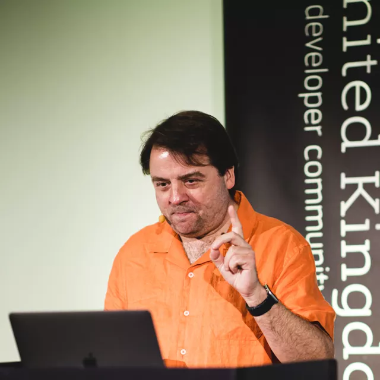

Peter Hilton has presented at conferences, user groups and companies in several countries on a variety of software development topics.
See also: [software development training courses](../training).

[Devoxx UK (left)](https://www.flickr.com/photos/125714253@N02/){:.photocredit}
[Skills Matter (centre, right)](https://skillsmatter.com/){:.photocredit}

Please [contact Peter](../contact) if you would like him to speak at your event or company.

## Recent presentations

<table class="table">
<tr>
	<th style="width:4.7em">Date</th>
	<th>Title</th>
	<th>Venue</th>
	<th>Location</th>
</tr>
<tr>
	<td>2023-05-10</td>
   <td><a href="bugs">Universal bugs</a></td>
	<td><a href="https://www.devoxx.co.uk">Devoxx UK</a></td>
	<td>🇬🇧 London</td>
</tr>
<tr>
   <td>2022-11-10</td>
   <td><a href="bugs">10 universal bugs</a></td>
   <td><a href="https://010php.nl">010PHP</a></td>
   <td>🇳🇱 Rotterdam</td>
</tr>
<tr>
   <td>2022-10-25</td>
   <td><a href="naming">How to name things</a></td>
   <td><a href="https://topicus.nl">Topicus</a> (company presentation)</td>
   <td>🇳🇱 Deventer</td>
</tr>
<tr>
   <td>2022-09-21</td>
   <td><a href="jokes">My ten favourite programming jokes</a></td>
   <td><a href="https://www.meetup.com/rotterdamjug/events/288279498/">Rotterdam JUG</a></td>
   <td>🇳🇱 Rotterdam</td>
</tr>
<tr>
	<td>2022-06-22</td>
	<td><a href="universal-values">Modelling universal values</a></td>
	<td>DDD Europe</td>
	<td>🇳🇱 Amsterdam</td>
</tr>
<tr>
	<td>2022-06-08</td>
	<td><a href="universal-values">Modelling universal values</a></td>
	<td><a href="http://jspring.nl/timetable-2022/">J-Spring</a></td>
	<td>🇳🇱 Utrecht</td>
</tr>
<tr>
	<td>2022-01-18</td>
	<td><a href="architect">Architect: the missing Scrum role</a></td>
	<td>company in-house</td>
	<td>🇳🇱 Deventer</td>
</tr>
</table>

## Selected previous presentations

<table class="table">
<tr>
	<th>Date</th>
	<th>Title</th>
	<th>Venue</th>
	<th>Location</th>
</tr>
<tr>
	<td>2021-04-08</td>
	<td><a href="dr-evil-api">Dr Evil’s World Domination API</a></td>
	<td>company in-house</td>
	<td>👨🏻‍💻 remote</td>
</tr>
<tr>
	<td>2020-09-01</td>
	<td><a href="documentation-comments">Write one-sentence documentation comments</a></td>
	<td><a href="https://www.meetup.com/Utrecht-Java-User-Group/">Den Bosch Java User Group</a></td>
	<td>👨🏻‍💻 remote</td>
</tr>
<tr>
	<td>2020-09-01</td>
	<td><a href="product-roadmaps">Product roadmaps</a></td>
	<td><a href="https://www.meetup.com/Utrecht-Java-User-Group/">Den Bosch Java User Group</a></td>
	<td>👨🏻‍💻 remote</td>
</tr>
<tr>
	<td>2020-02-25</td>
	<td><a href="technical-documentation">Technical documentation is a backup so make sure it works</a> (keynote)</td>
	<td><a href="https://cppeurope.com/sessions/technical-documentation-is-a-backup-so-make-sure-it-works/">C++ Europe</a></td>
	<td>🇷🇴 Bucharest</td>
</tr>
<tr>
	<td>2019-03-15</td>
	<td><a href="lilypond-workshop">Generating sheet music: from one DSL to another</a> (workshop)</td>
	<td><a href="https://2019.boosterconf.no/talks/1222">Booster</a></td>
	<td>🇳🇴 Bergen</td>
</tr>
<tr>
	<td>2019-09-10</td>
	<td><a href="challenge-your-po">How to challenge your PO</a></td>
	<td><a href="https://www.meetup.com/Utrecht-Java-User-Group/">Utrecht Java User Group</a></td>
	<td>🇳🇱 Utrecht</td>
</tr>
<tr>
	<td>2019-09-10</td>
	<td><a href="flat-http-api-documentation">Flat HTTP API Design</a></td>
	<td><a href="https://www.meetup.com/Utrecht-Java-User-Group/">Utrecht Java User Group</a></td>
	<td>🇳🇱 Utrecht</td>
</tr>
<tr>
	<td>2019-05-29</td>
	<td><a href="code-style">Coding style matters</a></td>
	<td><a href="https://jspring.nl/sessions/coding-style-matters-why-you-should-care-about-code-style-and-what-you-should-care-about/">J-Spring</a></td>
	<td>🇳🇱 Utrecht</td>
</tr>
<tr>
	<td>2018-11-29</td>
	<td><a href="agile-code-typography">Better source code through typography</a></td>
	<td><a href="http://www.xpdaysbenelux.nl/friday/#session_634">XP Days Benelux</a></td>
	<td>🇳🇱 Heeze</td>
</tr>
<tr>
	<td>2018-11-08</td>
	<td><a href="flat-http-api-documentation">Flat HTTP API Design</a></td>
	<td><a href="https://jfall.nl/sessions/flat-http-api-documentation/">J-Fall 2018</a></td>
	<td>🇳🇱 Ede</td>
</tr>
<tr>
	<td>2018-11-08</td>
	<td><a href="maintainable-code-workshop">How to write maintainable code</a> (workshop)</td>
	<td><a href="https://jfall.nl/pre-conference/">J-Fall 2018</a> pre-conference</td>
	<td>🇳🇱 Ede</td>
</tr>
<tr>
	<td>2018-06-13</td>
	<td><a href="beautiful-code">Beautiful code: typography and visual programming</a></td>
	<td><a href="https://ndcoslo.com/talk/beautiful-code-typography-and-visual-programming/">NDC</a></td>
	<td>🇳🇴 Oslo</td>
</tr>
<tr>
   <td>2018-05-31</td>
   <td><a href="beautiful-code">Beautiful code: typography and visual programming</a></td>
   <td><a href="http://jspring.nl/speakers/peter-hilton/">J-Spring</a></td>
   <td>🇳🇱 Utrecht</td>
   <td></td>
</tr>
<tr>
   <td>2018-05-09</td>
   <td><a href="beautiful-code">Beautiful code: typography and visual programming</a></td>
   <td><a href="https://2018.geecon.org/speakers/info.html?id=333">GeeCON</a></td>
   <td>🇵🇱 Kraków</td>
</tr>
<tr>
	<td>2018-03-15</td>
	<td><a href="beautiful-code">Beautiful code: typography and visual programming</a></td>
	<td><a href="https://2018.boosterconf.no/talks/1070">Booster</a></td>
	<td>🇳🇴 Bergen</td>
</tr>
<tr>
	<td>2018-03-06</td>
	<td><a href="../training/maintainable-code">How to write maintainable code (training)</a></td>
	<td>company in-house</td>
	<td>🇳🇱 Amsterdam</td>
</tr>
<tr>
	<td>2017-12-15</td>
	<td><a href="naming">How to name things</a></td>
	<td><a href="https://skillsmatter.com/conferences/8784-scala-exchange-2017">Scala eXchange</a></td>
	<td>🇬🇧 London</td>
</tr>
<tr>
	<td>2017-12-06</td>
	<td>Business English, Euro-English &amp; sexism</td>
	<td><a href="http://www.signavio.com/">Signavio GmbH</a></td>
	<td>🇩🇪 Berlin</td>
</tr>
<tr>
	<td>2017-11-29</td>
	<td><a href="workflow-service-architecture">Process-oriented reactive service architecture</a></td>
	<td><a href="https://www.meetup.com/Developers-nl-Meetup/events/242893857/">Developers.nl Meetup</a></td>
	<td>🇳🇱 Rotterdam</td>
</tr>
<tr>
	<td>2017-11-16</td>
	<td><a href="naming">How to name things</a></td>
	<td><a href="https://www.topconf.com/conference//topconf-tallinn-2017/talk/how-to-name-things-the-hardest-problem-in-programming/">Topconf</a></td>
	<td>🇪🇪 Tallinn</td>
</tr>
<tr>
	<td>2017-11-15</td>
	<td><a href="beautiful-code">Beautiful code: typography and visual programming</a></td>
	<td><a href="https://www.topconf.com/conference/topconf-tallinn-2017/">Topconf</a></td>
	<td>🇪🇪 Tallinn</td>
</tr>
<tr>
	<td>2017-11-02</td>
	<td><a href="naming">How to name things</a></td>
	<td><a href="http://jfall.nl/">J-Fall 2017</a></td>
	<td>🇳🇱 Ede</td>
</tr>
<tr>
	<td>2017-10-19</td>
	<td><a href="maintainable-code">How to write maintainable code</a></td>
	<td><a href="https://2017.geecon.cz/">GeeCON Prague</a></td>
	<td>🇨🇿 Prague</td>
</tr>
<tr>
	<td>2017-09-28</td>
	<td><a href="documentation-workshop">Minimum viable documentation</a> (workshop)</td>
	<td><a href="http://agilecambridge.net/2017/sessions/index.php?session=18">Agile Cambridge 2017</a></td>
	<td>🇬🇧 Cambridge</td>
</tr>
<tr>
	<td>2017-08-02</td>
	<td><a href="beautiful-code">Beautiful code: code with better type</a></td>
	<td><a href="http://edinburgh.bcs.org/events/2017/170802.htm">BCS Edinburgh</a></td>
	<td>🇬🇧 Edinburgh</td>
</tr>
<tr>
	<td>2017-07-22</td>
	<td>Intro to HTML, CSS and the command line</td>
	<td><a href="http://www.daysofcode.nl/">Days of Code</a></td>
	<td>🇳🇱 Rotterdam</td>
</tr>
<tr>
	<td>2017-05-16</td>
	<td><a href="maintainable-code">How to write maintainable code</a></td>
	<td><a href="http://amsterdam2017.codemotionworld.com/">Codemotion Amsterdam 2017</a></td>
	<td>🇳🇱 Amsterdam</td>
</tr>
<tr>
	<td>2017-05-12</td>
	<td><a href="documentation-workshop">Documentation for software developers</a> (workshop)</td>
	<td><a href="http://itakeunconf.com/sessions/documentation-for-software-developers/">I T.A.K.E. (Un) conference 2017</a></td>
	<td>🇷🇴 Bucharest</td>
</tr>
<tr>
	<td>2017-04-27</td>
	<td><a href="documentation-workshop">Documentation for software developers</a> (workshop)</td>
	<td><a href="https://conference.accu.org/site/stories/2017/schedule.html">ACCU 2017</a></td>
	<td>🇬🇧 Bristol</td>
</tr>
<tr>
	<td>2017-03-16</td>
	<td>README Driven Development (mini-workshop)</td>
	<td><a href="https://www.meetup.com/010DEV/events/237779181/">010DEV</a></td>
	<td>🇳🇱 Rotterdam</td>
</tr>
<tr>
<td>2017-03-16</td>
	<td>E-Prime for scientific writing</td>
	<td>Erasmus MC</td>
	<td>🇳🇱 Rotterdam</td>
</tr>
<tr>
	<td>2017-03-01</td>
	<td>Code style, Code review & pair programming</td>
	<td><a href="http://www.signavio.com/">Signavio GmbH</a></td>
	<td>🇩🇪 Berlin</td>
</tr>
<tr>
	<td>2016-12-09</td>
	<td><a href="maintainable-code">How to write maintainable Scala code</a></td>
	<td><a href="https://skillsmatter.com/conferences/7432-scala-exchange-2016">Scala eXchange</a></td>
	<td>🇬🇧 London</td>
	<td>
					</td>
</tr>
<tr>
	<td>2016-11-17</td>
	<td><a href="workflow-service-architecture">Process-oriented reactive service architecture</a></td>
	<td><a href="http://topconf.com/tallinn-2016/trackevent/process-oriented-reactive-service-architecture/">Topconf</a></td>
	<td>🇪🇪 Tallinn</td>
</tr>
<tr>
	<td>2016-11-16</td>
	<td><a href="documentation">Documentation avoidance for developers</a></td>
	<td><a href="http://topconf.com/tallinn-2016/trackevent/documentation-avoidance-for-developers/">Topconf</a></td>
	<td>🇪🇪 Tallinn</td>
</tr>
<tr>
	<td>2016-11-03</td>
	<td><a href="documentation">Documentation avoidance for developers</a></td>
	<td><a href="http://www.nljug.org/jfall/timetable/2016/">J-Fall</a></td>
	<td>🇳🇱 Ede</td>
</tr>
<tr>
	<td>2016-10-21</td>
	<td><a href="documentation">Documentation avoidance for developers</a></td>
	<td><a href="https://voxxeddays.com/thessaloniki/">Voxxed Days Thessaloniki</a></td>
	<td>🇬🇷 Thessaloniki</td>
</tr>
<tr>
	<td>2016-10-12</td>
	<td>Code Smells</td>
	<td><a href="http://www.signavio.com/">Signavio GmbH</a></td>
	<td>🇩🇪 Berlin</td>
</tr>
<tr>
	<td>2016-09-21</td>
	<td>Finance shared services with collaborative models</td>
	<td><a href="http://www.sharedservicesexchange.co.uk">Finance Shared Services & GBS Exchange</a></td>
	<td>🇳🇱 Hoofddorp</td>
</tr>
<tr>
	<td>2016-07-19</td>
	<td><a href="comments">How to write good comments</a></td>
	<td><a href="http://www.daysofcode.nl/">Days of Code</a></td>
	<td>🇳🇱 Rotterdam</td>
</tr>
<tr>
	<td>2016-07-18</td>
	<td><a href="http">HTTP demystified for web developers</a></td>
	<td><a href="http://www.daysofcode.nl/">Days of Code</a></td>
	<td>🇳🇱 Rotterdam</td>
</tr>
<tr>
	<td>2016-06-17</td>
	<td><a href="documentation">Documentation avoidance for developers</a></td>
	<td><a href="http://joyofcoding.org/">Joy of Coding</a></td>
	<td>🇳🇱 Rotterdam</td>
</tr>
<tr>
	<td>2016-06-13</td>
	<td><a href="http://irmuk.co.uk/eac2016/day1.cfm#Day1PS4">Modelling with Business Process Patterns</a></td>
	<td><a href="http://www.irmuk.co.uk/bpm2016/">IRM UK</a></td>
	<td>🇬🇧 London</td>
</tr>
<tr>
	<td>2016-04-25</td>
	<td>Process models for continuous improvement (workshop)</td>
	<td><a href="http://www.opexweekeurope.com/">OPEX &amp; Process Transformation Week</a></td>
	<td>🇬🇧 London</td>
</tr>
<tr>
	<td>2016-04-22</td>
	<td><a href="documentation">Documentation avoidance for developers</a> (keynote)</td>
	<td><a href="http://progscon.co.uk/talks#tlk-peterhiltontalk">ProgSCon London</a></td>
	<td>🇬🇧 London</td>
</tr>
<tr>
	<td>2016-03-03</td>
	<td>Achieving process excellence through collaborative BPM</td>
	<td><a href="http://c-parity.com/CP/2nd-annual-global-process-improvement-operational-excellence-summit-2/">Process Improvement &amp; OPEX Summit</a></td>
	<td>🇬🇧 London</td>
</tr>
<tr>
	<td>2015-06-06</td>
	<td><a href="http://www.typesafe.com/subscription/training">Fast Track To Play With Scala</a> (training course)</td>
	<td><a href="http://event.scaladays.org/scaladays-amsterdam-2015#03-Training">Scala Days 2015</a></td>
	<td>🇳🇱 Amsterdam</td>
</tr>
<tr>
	<td>2015-04-24</td>
	<td><a href="/blog/my-documentation-problem">My documentation problem</a> (lightning talk)</td>
	<td><a href="http://accu.org/index.php/conferences/accu_conference_2015/accu2015_schedule">ACCU 2015</a></td>
	<td>🇬🇧 Bristol</td>
</tr>
<tr>
	<td>2015-04-24</td>
	<td><a href="naming">How to name things</a></td>
	<td><a href="http://accu.org/index.php/conferences/accu_conference_2015/accu2015_schedule">ACCU 2015</a></td>
	<td>🇬🇧 Bristol</td>
</tr>
<tr>
	<td>2015-04-10</td>
	<td><a href="nomad">Modern IT nomad</a></td>
	<td><a href="http://nerdnight-rotterdam.tumblr.com/post/113780696094/modern-it-nomad">Nerd Night</a></td>
	<td>🇳🇱 Rotterdam</td>
</tr>
<tr>
	<td>2015-04-02</td>
	<td><a href="meeting-avoidance">Meeting-avoidance for self-managing developers</a></td>
	<td><a href="http://www.sytac.nl/">Sytac IT Consulting</a></td>
	<td>🇳🇱 Haarlem</td>
</tr>
<tr>
	<td>2014-12-08</td>
	<td><a href="scaling-web-dev">Scaling business app development with Play and Scala</a></td>
	<td><a href="https://skillsmatter.com/conferences/1948-scala-exchange-2014">Scala eXchange</a></td>
	<td>🇬🇧 London</td>
	<td>
					</td>
</tr>
<tr>
	<td>2014-11-24</td>
	<td><a href="comments">How to write good comments</a></td>
	<td><a href="http://www.softwire.com/">Softwire</a></td>
	<td>🇬🇧 London</td>
</tr>
<tr>
	<td>2014-10-07</td>
	<td><a href="play-framework-lessons-learned">Play Framework lessons learned</a></td>
	<td><a href="http://www.vmware.com/uk/">VMware</a></td>
	<td>🇬🇧 London</td>
</tr>
<tr>
	<td>2014-10-01</td>
	<td><a href="naming">How to name things</a></td>
	<td><a href="http://www.eventbrite.co.uk/e/spa-282-how-to-name-things-the-solution-to-the-hardest-problem-in-programming-tickets-13317502007">British Computer Society SPA</a></td>
	<td>🇬🇧 London</td>
</tr>
<tr>
	<td>2014-09-18</td>
	<td><a href="naming">How to name things</a></td>
	<td><a href="http://www.meetup.com/london-software-craftsmanship/events/206817472/">LSSC Talks</a></td>
	<td>🇬🇧 London</td>
</tr>
<tr>
	<td>2013-10-18</td>
	<td>Software project estimation</td>
	<td>Hoppinger</td>
	<td>🇳🇱 Rotterdam</td>
</tr>
<tr>
	<td>2013-06-27</td>
	<td>What we can learn from the Play Framework</td>
	<td><a href="http://www.meetup.com/amsterdam_play_framework/messages/54919312/">Play Framework Meetup</a></td>
	<td>🇳🇱 Amsterdam</td>
</tr>
<tr>
	<td>2012-11-07</td>
	<td>Play Framework 2</td>
	<td><a href="http://oredev.org/2012/sessions/play-framework-2">Øredev</a></td>
	<td>🇸🇪 Malmö</td>
</tr>
<tr>
	<td>2012-11-02</td>
	<td>Transparent development and project management</td>
	<td><a href="http://topconf.com/Conference/Abstracts/Transparentdevelopmentandtheprojectmanagement/tabid/141/language/en-US/Default.aspx">Topconf</a></td>
	<td>🇪🇪 Tallinn</td>
</tr>
<tr>
	<td>2012-10-17</td>
	<td>Play Framework 2</td>
	<td>JAX London</td>
	<td>🇬🇧 London</td>
</tr>
<tr>
	<td>2012-05-28</td>
	<td>In search of the perfect programmer</td>
	<td><a href="http://010dev.nl/post/social-tech-event-the-disruptor-and-the-perfect-programmer">010DEV</a></td>
	<td>🇳🇱 Rotterdam</td>
</tr>
<tr>
	<td>2012-05-24</td>
	<td>Play Framework 2.0</td>
	<td><a href="http://gotocon.com/amsterdam-2012/presentation/Play%20Framework%202.0">GOTO Amsterdam</a></td>
	<td>🇳🇱 Amsterdam</td>
</tr>
<tr>
	<td>2012-05-18</td>
	<td>Play Framework 2.0</td>
	<td><a href="http://2012.geecon.org/speakers/peter-hilton/index.html">GeeCON</a></td>
	<td>🇵🇱 Poznań</td>
</tr>
<tr>
	<td>2012-02-14</td>
	<td>Play Framework 2.0</td>
	<td>JFokus</td>
	<td>🇸🇪 Stockholm</td>
</tr>
<tr>
	<td>2012-02-08</td>
	<td>Why Play needs Scala and why Scala needs Play</td>
	<td><a href="http://blog.lunatech.com/2012/02/08/scala-stockholm">Scala-Stockholm</a></td>
	<td>🇸🇪 Stockholm</td>
</tr>
<tr>
	<td>2011-11-10</td>
	<td>Commercial software development survival tips</td>
	<td>Hogeschool Rotterdam</td>
	<td>🇳🇱 Rotterdam</td>
</tr>
<tr>
	<td>2011-09-08</td>
	<td>Play! Framework: to infinity and beyond</td>
	<td><a href="http://javazone.no/incogito10/events/JavaZone%202011/sessions#7f248f8a-300e-4078-b711-399d97135b02">Javazone</a></td>
	<td>🇳🇴 Oslo</td>
</tr>
<tr>
	<td>2011-04-24</td>
	<td>The myth of the on-site customer</td>
	<td>Talk About IT</td>
	<td>🇳🇱 Amsterdam</td>
</tr>
<tr>
	<td>2011-03-30</td>
	<td>Play framework: risks and rewards</td>
	<td>Connexys</td>
	<td>🇳🇱 Rotterdam</td>
</tr>
<tr>
	<td>2010-03-16</td>
	<td>How to build a decision service using JBoss Drools</td>
	<td>42.nl</td>
	<td>🇳🇱 Rotterdam</td>
</tr>
<tr>
	<td>2009-06-11</td>
	<td>The dirty secrets of Agile Software Development</td>
	<td>Bootstrapping & Agility</td>
	<td>🇳🇱 Rotterdam</td>
</tr>
<tr>
	<td>2009-05-22</td>
	<td>Language localisation in Java, JSF and Seam</td>
	<td>JBoss User Group</td>
	<td>🇳🇱 Rotterdam</td>
</tr>
<tr>
	<td>2008-12-10</td>
	<td>Meeting-avoidance for self-managing developers</td>
	<td><a href="http://www.devoxx.com/display/JV08/Meeting-avoidance+for+self-managing+developers">Devoxx</a></td>
	<td>🇧🇪 Antwerp</td>
</tr>
<tr>
	<td>2007-12-10</td>
	<td>JBoss Seam in Action</td>
	<td>JavaPolis</td>
	<td>🇧🇪 Antwerp</td>
</tr>
</table>

## Proposals

* [Overthinking numbers and strings](numbers-strings)
* [Musical ensemble safety](ensemble-safety)
* [Euro English for software developers](euro-english) -
  language-related bugs for European teams
* [Software design for tech leads](software-design) -
  escaping the gap between functional and technical design

## Not scheduled

* _HTTP API checklist_ or _Dr Evil’s HTTP API_
* _7 joys of coding_ - things that bring joy to writing code
* _4 kinds of software design for application developers_
